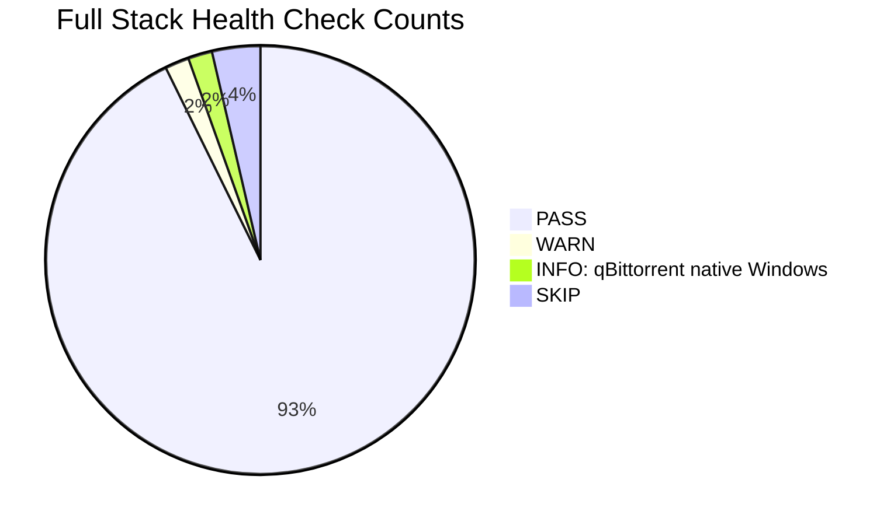
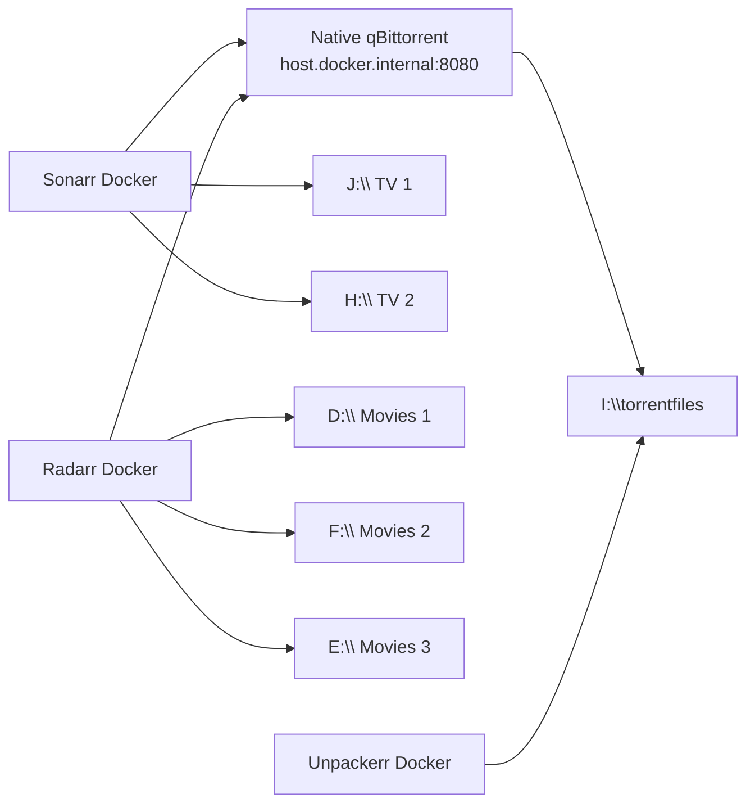

# Full Ecosystem Health Report - Native qBittorrent

Generated: `2026-05-30 14:35-14:40 -07:00`

## Executive Summary

| Area | Status | Notes |
|---|---|---|
| Docker stack | PASS | Sonarr, Radarr, Prowlarr, Bazarr, Tautulli, Uptime Kuma, and Unpackerr are running. |
| Native qBittorrent | PASS | Native Windows qBittorrent `5.2.1` is running on port `8080`. |
| qBittorrent compose service | REMOVED | qBittorrent is no longer declared in compose; current operations use the native Windows install. |
| Drive roots | PASS WITH RISK | All configured roots are present. `G:` is labeled `Broken Power Pin`, which is a known stability risk variable. |
| Arr health | PASS | Sonarr, Radarr, and Prowlarr API health checks returned zero issues. |
| Download clients | PASS | Sonarr and Radarr both tested successfully against native qBittorrent at `host.docker.internal:8080`. |
| Queues | PASS | Sonarr and Radarr queues both reported zero items. |
| Recent Windows errors | WATCH | No new WHEA/crash/disk/storage errors in the checked window; non-fatal TPM and Intel service/link events were present. |

## Health Scorecard

## Service Status

| Component | Runtime | Status | Port |
|---|---|---|---|
| qBittorrent | Native Windows | Running | `8080`, `6881/tcp` |
| Sonarr | Docker | Running | `8989` |
| Radarr | Docker | Running | `7878` |
| Prowlarr | Docker | Running | `9696` |
| Bazarr | Docker | Running | `6767` |
| Tautulli | Docker | Running | `8181` |
| Uptime Kuma | Docker | Running, healthy | `3001` |
| Unpackerr | Docker | Running | none exposed |
| Jackett | Docker profile | Disabled intentionally | none |

## Port Checks

| Port | Service | Result |
|---:|---|---|
| `8080` | Native qBittorrent Web UI | PASS |
| `8989` | Sonarr | PASS |
| `7878` | Radarr | PASS |
| `9696` | Prowlarr | PASS |
| `6767` | Bazarr | PASS |
| `8181` | Tautulli | PASS |
| `3001` | Uptime Kuma | PASS |

## Drive And Mount Map

| Drive | Volume | Role | Size TiB | Free TiB | Container mapping |
|---|---|---|---:|---:|---|
| `C:` | unlabeled | OS/config | `0.23` | `0.15` | config folders on `C:\media-stack\config` |
| `D:` | Movies 1 | Movies root 1 | `18.19` | `10.64` | Radarr `/movies/movies1` |
| `E:` | Movies 3 | Movies root 3 | `7.28` | `6.82` | Radarr `/movies/movies3` |
| `F:` | Movies 2 | Movies root 2 | `7.28` | `2.36` | Radarr `/movies/movies2` |
| `G:` | Broken Power Pin | Spare media root | `18.19` | `18.19` | Not used by active Arr imports |
| `H:` | TV 2 | TV root 2 | `18.19` | `7.65` | Sonarr `/tv/tv2` |
| `I:` | Torrent | Downloads | `18.19` | `14.02` | `/downloads`, native qBit save path |
| `J:` | TV 1 | TV root 1 | `14.55` | `3.08` | Sonarr `/tv/tv1` |

## Storage Utilization

| Drive | Used | Free | Usage |
|---|---:|---:|---|
| `D:` Movies 1 | `7.55 TiB` | `10.64 TiB` | `[########------------] 42%` |
| `E:` Movies 3 | `0.46 TiB` | `6.82 TiB` | `[#-------------------] 7%` |
| `F:` Movies 2 | `4.92 TiB` | `2.36 TiB` | `[##############------] 68%` |
| `G:` Broken Power Pin | `0.00 TiB` | `18.19 TiB` | `[--------------------] 0%` |
| `H:` TV 2 | `10.54 TiB` | `7.65 TiB` | `[############--------] 58%` |
| `I:` Torrent | `4.17 TiB` | `14.02 TiB` | `[#####---------------] 23%` |
| `J:` TV 1 | `11.47 TiB` | `3.08 TiB` | `[################----] 79%` |

## Arr And qBittorrent Configuration

| Service | Download client | Category | Remote path mapping | Test |
|---|---|---|---|---|
| Sonarr | `host.docker.internal:8080` | `tv-sonarr` | `I:\torrentfiles\` -> `/downloads/` | PASS |
| Radarr | `host.docker.internal:8080` | `radarr` | `I:\torrentfiles\` -> `/downloads/` | PASS |

| Native qBittorrent Setting | Value |
|---|---|
| Version | `5.2.1` |
| Save path | `I:\torrentfiles` |
| Temp path | `I:\torrentfiles\incomplete` |
| DHT | `false` |
| PeX | `false` |
| LSD | `false` |
| Max global connections | `50` |
| Max connections per torrent | `10` |
| Loaded torrents | `14`, all complete |
| qBittorrent state mix | `2 stalledUP`, `12 queuedUP` |

## API Health

| Service | Health issues | Queue total | Notes |
|---|---:|---:|---|
| Sonarr | `0` | `0` | Healthy; native qBit test passed. |
| Radarr | `0` | `0` | Healthy; native qBit test passed. |
| Prowlarr | `0` | n/a | `2` indexers configured, `2` enabled. |

## Docker Resource Snapshot

| Container | CPU | Memory | PIDs |
|---|---:|---:|---:|
| Bazarr | `13.70%` | `229.2 MiB` | `141` |
| Radarr | `19.37%` | `265.2 MiB` | `29` |
| Sonarr | `3.13%` | `183.9 MiB` | `32` |
| Prowlarr | `1.86%` | `131.8 MiB` | `26` |
| Tautulli | `0.02%` | `85.81 MiB` | `29` |
| Uptime Kuma | `3.68%` | `130.5 MiB` | `19` |
| Unpackerr | `0.00%` | `5.254 MiB` | `10` |
| torrent-mcp | `0.15%` | `76.16 MiB` | `1` |

## Windows Event Snapshot

| Event class | Result |
|---|---|
| WHEA fatal hardware error | None in checked post-start window |
| Kernel-Power crash/reset | None in checked post-start window |
| Disk/storage-controller errors | None in checked post-start window |
| TCP/IP errors | None in checked post-start window |
| Intel I226-V link events | Link disconnect/reconnect around boot/network recovery |
| Other non-fatal events | TPM Secure Boot CA/key warning; Intel Platform License Manager service timeout |

## Watch Items

| Priority | Item | Why it matters |
|---|---|---|
| High | `G:` labeled `Broken Power Pin` is connected | This reintroduces a prior hardware/cabling suspect into the test. If the machine crashes, this variable must be considered. |
| High | Native qBittorrent now has 14 completed torrents loaded | This is a heavier qBit network/session state than the tiny public smoke test. |
| Medium | Historical qBittorrent orphan container may still exist locally | It is not part of compose or current operations. |
| Medium | Bazarr CPU/PID count was higher than other small services | Not a fault by itself, but worth watching during the first full-stack soak. |

## Interpretation

This is a valid full-ecosystem test posture with native qBittorrent and Docker Arr services. qBittorrent is outside compose, while all media drives and major services are present.

If the server remains stable in this state, suspicion shifts further away from basic Arr/Docker service startup and toward the previous qBittorrent compose path or a specific drive/cable/load combination. If it crashes, the important new variables are all drives connected, especially `G:` with the `Broken Power Pin` label, plus native qBittorrent restoring 14 completed torrents.
